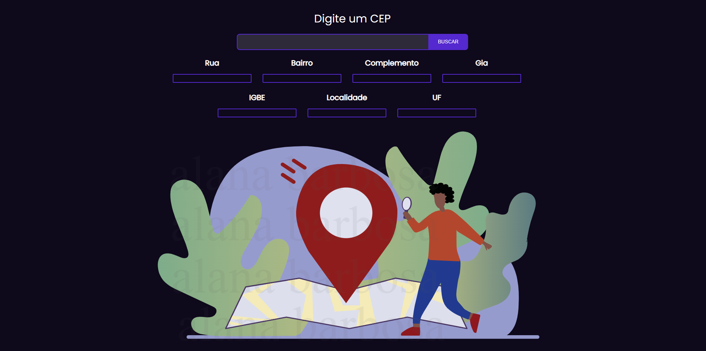
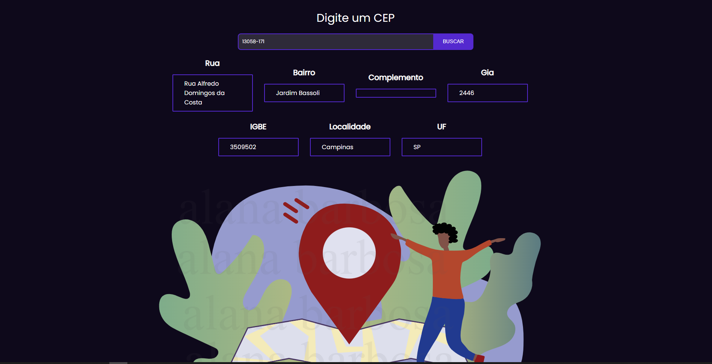

# Buscar CEP Via API - ViaCep  🔍📌

Aplicação feita em Javascript, para consultar CEP de endereçamento do Brasil gratuitamente. Para Consultar CEP basta você fazer uma **requisição http** para a **API do ViaCep** e então obter o retorno com informações como **CEP**, nome da **Cidade**, **Código do Município**, **UF**, etc.

# Imagens 📸

